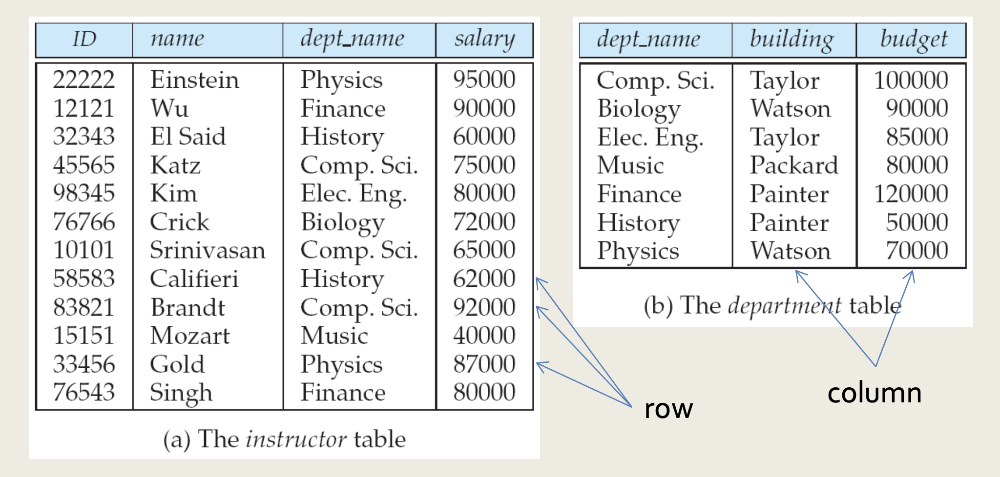

# View of Data

> 작성자: 이재혁

> Database system은 사용자가 데이터에 접근하고 수정할 수 있도록 하는 상호 연관된(inter-related) 데이터와 프로그램의 집합이다.   
> Database system의 주요 목적은 사용자에게 데이터에 대한 *추상적인* 뷰를 제공하는 것이다.  
> 즉, 시스템은 데이터가 어떻게 저장되고 유지되는지에 대한 특정한 세부사항을 숨김

## 목차
- Data Models
- Schemas and Instances

## Data Models
> 데이터 모델은 데이터, 데이터 관계, 데이터 의미론, 일관성 제약을 설명하기 위한 개념적 도구의 집합이다.
- **Relational Model**
  - 모든 데이터는 다양한 **tables** (or **relations**)에 저장된다.
  
- **Entity-Relationship Model**
  - E-R 데이터 모델은 Entity라 불리는 기본적인 개체들ㅇ릐 집합과 이 개체들 간의 관계를 이용한다.
  - E-R 모델은 DB 설계에서 널리 사용됨.
- **Semi-structured Data Model**
  - 동일한 유형의 개별 데이터 항목들이 서로 다른 attribute 집합을 가질 수 있는 데이터의 specification을 허용함
  - JSON과 XML(Extensible Markup Language)가 널리 사용되는 semi-structured data 표현임
- **Object-Based Data Model**
  - 객체 지향 프로그래밍(특히 Java, C++ or C#에서)은 지배적인 소프트웨어 개발 방법론이 되었다. 이로 인해 처음에는 구별되는 객체 지향 데이터 모델이 개발되었지만,
  - 오늘날 객체의 개념은 관계형 DB에 잘 통합되어 있음
  - DB 시스템은 프로시저를 DB 시스템에 저장하고 DB 시스템에 의해 실행되도록 함. 
  - 이는 캡슐화, 방법, 객체 아이덴티티 개념으로 관계형 모델을 확장한 것으로 볼 수 있음

## Schemas and Instances
> - 데이터베이스는 정보가 삽입되고 삭제됨에 따라 시간의 흐름에 따라 변화함.
> - 특정 순간에 데이터베이스에 저장된 정보의 집합을 **인스턴스**라고 함.
> - 데이터베이스의 전체적인 설계를 **스키마**라고 함.
> 스키마와 인스턴스의 개념은 프로그래밍 언어로 작성된 프로그램에 비유하여 이해할 수 있다.
> - 데이터베이스 **스키마**는 프로그램 내의 변수 선언(타입 정의와 함께)에 해당함.
> - 각 변수는 주어진 순간에 특정한 값을 가짐. 한 시점의 프로그램 내 변수의 값은 데이터베이스 스키마의 **인스턴스**에 해당함.

데이터베이스 시스템들은 추상화 레벨들에 따라 분할되는 여러 스키마들을 갖는다.
- Physical Schema(물리적 스키마)는 물리적 레벨에서 데이터베이스 설계를 기술함
- Logical Schema(논리적 스키마)는 논리적 레벨에서 데이터베이스 설계를 기술함

Physical data independence
- 논리 스키마를 변경하지 않고 물리적 스키마를 수정할 수 있음
- 응용 프로그램은 논리 스키마에 따라 달라짐
- 일반적으로, 다양한 수준과 구성요소들 사이의 인터페이스는 일부 파츠의 변화가 다른 부분들에 심각한 영향을 미치지 않도록 잘 정의되어야 함.