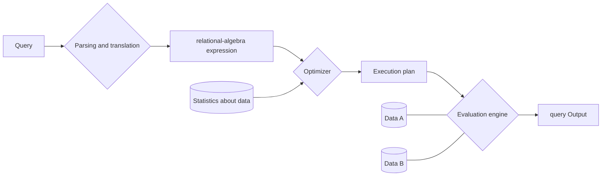

# Database Engine

> 작성자: 최선규

## 목차

- [Database Engine](#database-engine)
  - [목차](#목차)
  - [Storage Management](#storage-management)
    - [Storage manager](#storage-manager)
  - [Query Processing](#query-processing)
    - [Query Processor](#query-processor)
  - [Transaction Management](#transaction-management)
    - [Transaction](#transaction)
    - [Transaction의 특징](#transaction의-특징)

## Storage Management

### Storage manager

- low-level data structure와 application programs & queries 사이의 interface 제공
- Responsible for:
  - reading/writing data
  - indexing
  - locking
  - transaction management
  - buffer management
  - etc.

[Issues]

- Storage access
- File organization
- Indexing and hashing

## Query Processing

### Query Processor

- Parsing and translation
  - query를 parsing하고, relational-algebra expression으로 변환
- Optimization
  - Optimizer가 미리 수집한 시스템 및 오브젝트 통계정보를 바탕으로, 가장 효율적인 실행 계획(Execution Plan)을 선택
- Evaluation

<center>



</center>

## Transaction Management

### Transaction

> Database의 상태를 변화시키기 위해 수행하는 작업의 단위<br>
> 참고자료: [DB 트랜잭션(Transaction)](https://gyoogle.dev/blog/computer-science/data-base/Transaction.html)

상태를 변화 시킨다는 것 = Query를 통해 DB에 접근하는 것

```sql
SELECT
INSERT
UPDATE
DELETE
```

<br>

작업 단위 = 많은 Query문들을 사람이 정하는 기준에 따라 정하는 것

```text
예시) 사용자 A가 사용자 B에게 만원을 송금한다.

* 이때 DB 작업
- 1. 사용자 A의 계좌에서 만원을 차감한다 : UPDATE 문을 사용해 사용자 A의 잔고를 변경
- 2. 사용자 B의 계좌에 만원을 추가한다 : UPDATE 문을 사용해 사용자 B의 잔고를 변경

현재 작업 단위 : 출금 UPDATE문 + 입금 UPDATE문
→ 이를 통틀어 하나의 트랜잭션이라고 한다.
- 위 두 쿼리문 모두 성공적으로 완료되어야만 "하나의 작업(트랜잭션)"이 완료되는 것이다. `Commit`
- 작업 단위에 속하는 쿼리 중 하나라도 실패하면 모든 쿼리문을 취소하고 이전 상태로 돌려놓아야한다. `Rollback`
```

### Transaction의 특징

- 원자성 (Atomicity)
  - 트랜잭션은 DB에 모두 반영되거나, 전혀 반영되지 않아야 한다.
- 일관성 (Consistency)
  - 트랜잭션의 작업처리 결과는 항상 일관성이 있어야 한다.
- 독립성 (Isolation)
  - 둘 이상의 트랜잭션이 동시에 병행 실행되고 있을 때, 서로 다른 트랜잭션은 서로 영향을 미치지 않아야 한다.
- 지속성 (Durability)
  - 트랜잭션이 성공적으로 완료되었으면, 결과는 영구적으로 반영되어야 한다.
