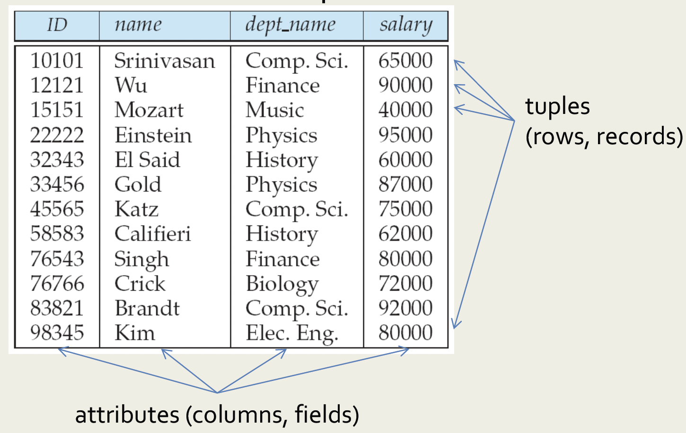

# Structure of Relational Databases

> 작성자: 김나현

## 목차

- Relation(table) 예시
- 용어 정리
- Attribute types

### Relation (table) 예시

관계형 데이터베이스는 일반적으로 미리 정의된 column이 있는 row로 테이블에서 데이터를 저장함
 

### 용어 정리

- `relation`: 데이터를 원자 값으로 갖는 이차원의 테이블
- `attribute`: column, field
- `tuple`: row, record
   

### Attribute types

- 각 attribute에 허용되는 값의 집합을 attribute의 도메인이라고 함
- attribute의 값은 atomic하기를 요구받음
  → 더이상 쪼갤 수 없는 속성
- null은 값의 "unknown" 또는 "non-existent"를 나타내는 모든 도메인의 멤버
